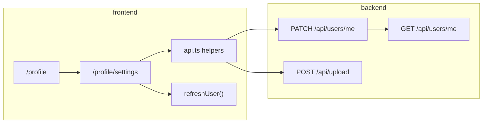

# Account Settings — Implementation Plan

This document describes how to add an **Account Settings** page where authenticated users can change:

1. Password  
2. Username  
3. Profile image  

It is based on the current codebase state (profile page, auth, upload, and user APIs) and is intended to be followed in order before and during implementation.

---

## Goals

- From `/profile`, **Account Settings** navigates to a dedicated settings page.
- Users can update username, password (where applicable), and profile photo.
- Changes persist in the database and reflect immediately on the profile and leaderboard after refresh.
- Reuse existing patterns: JWT auth, Zod validation, Garage upload, `PageShell`, `useAuth().refreshUser()`.

---

## Current State (Baseline)

| Area | Status |
|------|--------|
| **Profile UI** | `UserProfile` renders `SettingsButton`; `onClick` only logs to console |
| **Routing** | `/profile` is protected via `PrivateRoute`; no settings route |
| **Backend users API** | `GET /api/users/me` only — no update endpoints |
| **Database** | `users` has `username`, `email`, `password` (nullable for Google OAuth); **no** `profile_image_url` column |
| **Image upload** | `POST /api/upload` → Garage (used for report/cleanup photos) |
| **Leaderboard UI** | `ProfilePicture` supports `profilePictureUrl`; API mapping hardcodes `null` |
| **Profile header** | Initial-letter avatar only; no image URL prop |

**Key files today**

- `frontend/src/pages/UserProfile.tsx` — settings button stub  
- `frontend/src/components/SettingsButton.tsx`  
- `frontend/src/components/ProfileHeader.tsx`  
- `frontend/src/components/Leaderboard/leaderboardAvatar.tsx`  
- `frontend/src/context/AuthContext.tsx` — `refreshUser()` after login  
- `backend/src/routes/userRoutes.ts` — `GET /me`  
- `backend/src/db/schema.ts` — `users` table  
- `backend/src/controllers/authController.ts` — register/login/Google; password nullable for Google users  

---

## Architecture Overview



**UX shape:** one settings page with **three sections** (not three separate routes).

---

## Phase 1 — Routing and Page Shell (Frontend)

**Deliverable:** Navigable settings page with layout; forms can be stubbed.

### Tasks

1. Add route `/profile/settings` inside the existing `PrivateRoute` group in `frontend/src/App.tsx` (same protection as `/profile`).
2. Create `frontend/src/pages/AccountSettingsPage.tsx`:
   - Wrap in `PageShell`
   - “← Back” to `/profile` (same pattern as `AboutPage.tsx`)
   - Title: e.g. “Account settings”
   - Three sections (cards): **Profile photo**, **Username**, **Password**
3. Update `UserProfile.tsx`: `SettingsButton` → `navigate('/profile/settings')` instead of `console.log`.

### Acceptance

- Logged-in user can open settings from profile and return to profile.
- Unauthenticated users cannot reach the route (existing `PrivateRoute` behavior).

---

## Phase 2 — Backend: Schema and API

**Deliverable:** Authenticated partial updates for the current user.

### 2.1 Database migration

Add column to `users`:

```sql
profile_image_url VARCHAR(500)  -- nullable
```

Update:

- `backend/src/db/schema.ts` — `profileImageUrl` on `users` table  
- `backend/src/db/userPublicColumns.ts` — include in public API responses  
- New Drizzle migration under `backend/drizzle/`  

### 2.2 `PATCH /api/users/me`

- **Auth:** `authenticate` middleware (already used on user routes after public leaderboard).
- **Handler:** new function in `userController.ts` (e.g. `updateMe`).
- **Validation:** Zod schema with **optional** fields; only update fields present in the body.

| Field | Request body | Validation / behavior |
|-------|----------------|------------------------|
| `username` | `{ "username": "..." }` | 3–50 chars (match `registerSchema`); unique; on conflict return 409 with message like registration |
| `password` | `{ "currentPassword": "...", "newPassword": "..." }` | `newPassword` min 8 chars; verify `currentPassword` with `bcrypt.compare` when user has a password |
| `profileImageUrl` | `{ "profileImageUrl": "https://..." }` or `null` | Store URL after client upload; `null` clears avatar |

**Google / OAuth users** (`password` is `null` in DB):

- **Change password:** require `currentPassword` only when `user.password` is set.
- **Set password:** allow `{ "newPassword": "..." }` without `currentPassword` when `password` is null (optional product decision — see Open Decisions).

**Response:**

- Return updated public user fields (at minimum what `publicUserColumns` exposes), or re-use enriched shape from `getMe` if the client should refresh stats in one call.
- Never include `password` in JSON.

**Errors:**

- `400` — validation  
- `401` — missing/invalid JWT  
- `403` — N/A for `/me` (self only)  
- `409` — duplicate username (`23505` / `users_username_unique`)  
- `500` — server error  

### 2.3 Swagger

Document `PATCH /api/users/me` in `backend/src/routes/userRoutes.ts` next to `GET /me`.

### 2.4 Leaderboard

Update `getLeaderboard` (and any user list responses) to select and return `profileImageUrl` so leaderboard avatars work after upload.

### Acceptance

- `PATCH` updates username, password, and `profileImageUrl` in DB.  
- `GET /api/users/me` includes `profileImageUrl`.  
- Google user without password can set password (if product decision allows).  
- Email/password login user must supply correct current password to change password.

---

## Phase 3 — Profile Image Upload Flow

**Deliverable:** End-to-end avatar upload and removal.

### Recommended flow (two steps, reuses existing infra)

1. Client uploads file via existing `POST /api/upload` (same as reports — `uploadReportImage` in `frontend/src/api.ts`).
2. Client sends `PATCH /api/users/me` with `{ profileImageUrl: returnedUrl }`.

### Optional hardening (later)

- Garage key prefix: `avatars/{userId}/...`  
- Validate `profileImageUrl` host matches configured public Garage base URL  
- Stricter MIME/size limits dedicated to avatars (multer already limits uploads on upload route)  

### Removal

- `PATCH` with `{ profileImageUrl: null }` — UI shows initials fallback again.

### Acceptance

- New photo appears on settings preview, profile header, and leaderboard after `refreshUser()`.  
- Remove photo restores letter avatar.

---

## Phase 4 — Frontend API and Forms

**Deliverable:** Working forms wired to backend.

### 4.1 Types and API client (`frontend/src/api.ts`)

- Add `profileImageUrl: string | null` to `AuthUser` / `MeUser`.  
- Add `updateMyProfile(payload)` → `PATCH /api/users/me` with `Authorization: Bearer`.  
- Optionally `changePassword(current, next)` as a thin wrapper around the same endpoint.

### 4.2 `normalizeMeUser` (`AuthContext.tsx`)

- Default `profileImageUrl` to `null` if absent from API.

### 4.3 Account settings page sections

#### Profile photo

- File input / “Change photo” (pattern from `AddPicturePage.tsx`).  
- Preview before save.  
- Flow: upload → PATCH URL → `refreshUser()`.  
- “Remove photo” button → PATCH `null` → `refreshUser()`.  
- Loading and error states per action.

#### Username

- Text input prefilled from `authState.user.username`.  
- Save → `updateMyProfile({ username })` → `refreshUser()`.  
- Display server error (e.g. “Username is already taken”).

#### Password

- Fields: current password, new password, confirm new password (client validates match).  
- If user has no password (Google): show **Set password** (new + confirm only) — align with backend rules.  
- If user should not set password: hide section (product decision).  
- Success: clear fields; optional message “Password updated”.

### 4.4 After every successful mutation

Call `refreshUser()` so `UserProfile` and localStorage stay in sync.

### Acceptance

- All three features work against a running backend with Garage configured.  
- Errors from API surface in the UI.  
- No silent failures on upload or PATCH.

---

## Phase 5 — Display Avatar Across the App

**Deliverable:** Consistent avatar UX everywhere usernames appear.

### Tasks

1. **`ProfileHeader`:** Add optional `profileImageUrl`; reuse image + fallback logic from `leaderboardAvatar.tsx` (or extract shared `UserAvatar` component).  
2. **`UserProfile`:** Pass `user.profileImageUrl` into `ProfileHeader`.  
3. **Leaderboard:** Stop forcing `profilePictureUrl: null` in `api.ts` when mapping leaderboard entries; use API field.  
4. Align naming: DB/API `profileImageUrl` vs frontend leaderboard `profilePictureUrl` — pick one name in API and map once in the client if needed.

### Acceptance

- Profile and leaderboard show the same image for the same user.  
- Broken image URL falls back to initials (existing `onError` behavior in leaderboard component).

---

## Suggested Implementation Order (PRs)

| Order | Scope | Shippable? |
|-------|--------|------------|
| 1 | Route + `AccountSettingsPage` shell + wire `SettingsButton` | Yes (UI only) |
| 2 | Migration + `PATCH` username + username form + `refreshUser` | Yes |
| 3 | `PATCH` password + password form + Google/set-password edge case | Yes |
| 4 | `profileImageUrl` column + upload + PATCH + photo UI + `ProfileHeader` | Yes |
| 5 | Leaderboard field + swagger polish + manual test pass | Yes |

---

## Security Checklist

- [ ] All mutations require valid JWT (`authenticate`).  
- [ ] Users can only update their own record (`req.user.id`).  
- [ ] Password never returned in API responses.  
- [ ] `bcrypt` with same cost as registration (10 rounds).  
- [ ] Username uniqueness enforced at DB + friendly 409 message.  
- [ ] (Optional later) Rate-limit password change attempts.  
- [ ] (Optional later) Validate avatar URLs point to trusted storage host.

---

## Manual Test Plan

### Username

- [ ] Change to a valid new username → profile shows new name.  
- [ ] Change to an existing username → error shown, no change.  
- [ ] Invalid length (< 3 or > 50) → validation error.

### Password (email/password account)

- [ ] Wrong current password → 401/400, no change.  
- [ ] Valid change → can log in with new password.  
- [ ] Mismatched confirm on client → blocked before request.

### Password (Google account)

- [ ] Set password without current (if supported) → can log in with email + new password.  
- [ ] Or section hidden if not supported.

### Profile image

- [ ] Upload image → visible on profile and settings.  
- [ ] Remove image → initials avatar.  
- [ ] Invalid/broken URL → fallback initials (leaderboard behavior).

### Navigation

- [ ] Settings only reachable when logged in.  
- [ ] Back returns to profile.

---

## Open Decisions (resolve before Phase 2–3)

| # | Question | Options |
|---|----------|---------|
| 1 | **Google users** | Allow “set password” for email+password login later, or hide password section entirely |
| 2 | **Avatar upload API** | **A)** Reuse `POST /api/upload` + `PATCH` URL (recommended). **B)** Single `POST /api/users/me/avatar` that uploads and updates in one request |
| 3 | **Email changes** | Out of scope for this plan; would need verification flow |
| 4 | **Field naming** | Standardize on `profileImageUrl` in API vs `profilePictureUrl` in leaderboard types |
| 5 | **Password change side effects** | Invalidate other sessions / re-issue JWT? Default: no change to token (simpler) |

**Recommended defaults:** (1) Allow set password for Google users. (2) Option A. (4) API `profileImageUrl`, map to leaderboard `profilePictureUrl` in one place if renaming is costly.

---

## Out of Scope (for this plan)

- Changing email address  
- Two-factor authentication  
- Account deletion  
- Admin editing other users’ profiles (admin list exists; not part of self-service settings)  
- Cropping/resizing images server-side (client can resize later if needed)

---

## File Checklist (expected touch list)

### Frontend

- `frontend/src/App.tsx` — route  
- `frontend/src/pages/UserProfile.tsx` — navigate to settings  
- `frontend/src/pages/AccountSettingsPage.tsx` — **new**  
- `frontend/src/api.ts` — types + `updateMyProfile`  
- `frontend/src/context/AuthContext.tsx` — normalize `profileImageUrl`  
- `frontend/src/components/ProfileHeader.tsx` — show image  
- `frontend/src/components/Leaderboard/*` — use real URL from API (if applicable)  

### Backend

- `backend/src/db/schema.ts`  
- `backend/src/db/userPublicColumns.ts`  
- `backend/drizzle/*` — migration  
- `backend/src/controllers/userController.ts` — `updateMe`  
- `backend/src/routes/userRoutes.ts` — `PATCH /me` + swagger  
- `backend/src/config/swagger.ts` — schema update if needed  

---

## References

- Registration validation: `backend/src/controllers/authController.ts` (`registerSchema`)  
- Upload: `backend/src/routes/uploadRoutes.ts`, `frontend/src/api.ts` (`uploadReportImage`)  
- Profile refresh: `frontend/src/context/AuthContext.tsx` (`refreshUser`)  
- Similar doc style: `CLEANUP_FLOW_SUMMARY.md`  

---

*Last updated: planning document created before implementation.*
